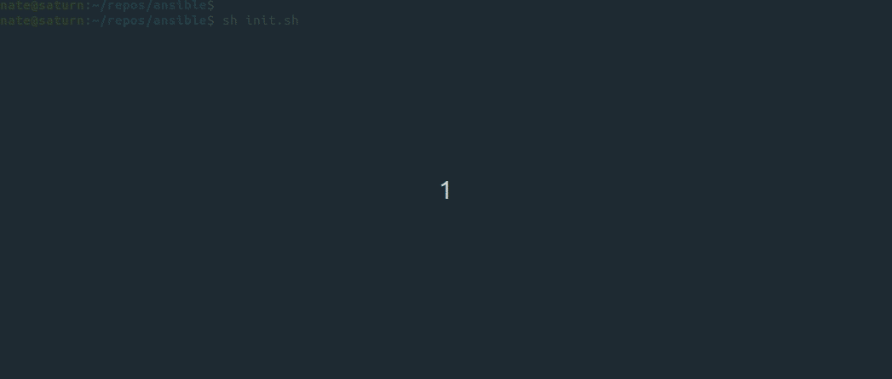

# Ansible

## Overview

This project was created to manage/orchestrate a lab environment.  
If you 

## Tools

This project leverages the following tools:
 - [Ansible](https://www.ansible.com/)
 - [HashiCorp Vault](https://www.vaultproject.io/)

## Assumptions

This project assumues the following are true:
 - You have docker installed on your workstation
 - For the first run of init.sh, you have internet access
 - You have a lab environment with either Junos or Cisco ASAs deployed
 - That you're comfortible editing a python script

## Demo



## Getting Started

To save time and to reduce steps, I've created an init script for this project.  
To begin, simply run the init script with the steps below.  

```bash
git clone https://github.com/natemellendorf/ansible.git
cd ansible

# Edit ./init.sh, and update the [Replace as needed] section
# Edit ./inventory/inventory.py, and update the hostvars as needed

chmod +x init.sh
sh init.sh
```

### What does init.sh do?

This init script will perform the following tasks:
 - Set temp environment variables for HashiCorp Vault
 - Download the HashiCorp Vault container
 - Build an Ansible container
   - The container will use the files located in the ansible directoy
 - Start the Vault container
 - Exec into the Vault container, and create the secrets you set in init.sh
 - Start the Ansible container
   - At this point, you'll be free to run ansible commands
 - When complete, remove the containers

### How does [inventory.py](inventory/inventory.py) work?

[Inventory.py](inventory/inventory.py) is a dynamic inventory script written in Python.  
Currently, it's outputs are hard coded with an exception for device secrets.  
Using the [HashiCorp Python SDK](https://pypi.org/project/hvac/), it will retrieve the secrets created by init.sh on each playbook run.

## Testing

```bash
# Test your inventory
ansible all -i inventory.py -m ping

# Run an example playbook against all devices
ansible-playbook playbooks/example.yml

```

## To Do

- Integrate [Vagrant](https://www.vagrantup.com/) to deploy a fleet of network devices with init.sh
- Integrate NetBox, and rewrite [inventory.sh](inventory/inventory.py) to leverage its API for device inventory
- Update [docker-compose.yml](docker-compose.yml) to deploy additional containers
- Write additonal tests in GitHub actions
- Go to the beach...
